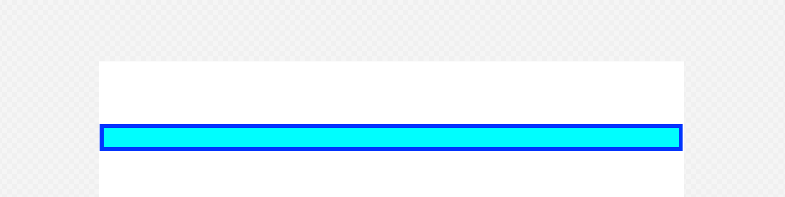

# progressbar
A simple progress bar built using Javscript, HTML and CSS.

## Built With

- Javascript
- HTML 
- CSS

## Description

A simple progress bar built using Javscript, HTML and CSS.

[Demo](https://rawcdn.githack.com/Bluette1/progressbar/feature/add-progressbar/Progressbar.html)

## Authors

👤 **Marylene Sawyer**
- Github: [@Bluette1](https://github.com/Bluette1)
- Twitter: [@MaryleneSawyer](https://twitter.com/MaryleneSawyer)
- Linkedin: [Marylene Sawyer](https://www.linkedin.com/in/marylene-sawyer-b4ba1295/)

# Acknowledgements

- The content in this repository was retrieved from or inspired by the following sites
  - [Microverse](https:www.microverse.org/) - @microverseinc
  - [W3schools](https://www.w3schools.com/)

## 🤝 Contributing

Contributions, issues and feature requests are welcome!

Feel free to check the [issues page](https://github.com/Bluette1/progressbar/issues).

## Show your support

Give a ⭐️ if you like this project!

## 📝 License

This project is [MIT](https://opensource.org/licenses/MIT) licensed.
